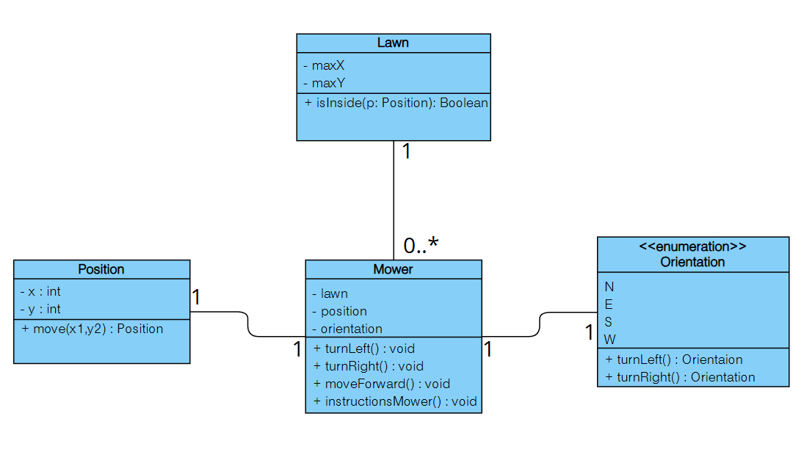

# Mower Kata – Java

Ce projet est une implémentation du kata des tondeuses.  
L’objectif est de simuler plusieurs tondeuses se déplaçant sur une pelouse rectangulaire.

Je suis parti du template fourni dans le repository fourni sur les recommendations du test, puis j’ai ajouté toute la logique métier, les classes nécessaires et les tests.

## 📐 Diagramme de classes

Ce diagramme résume la structure globale utilisée dans le projet :



## Structure du projet

Le projet est organisé en plusieurs classes, chacune ayant un rôle clair :

- **`Lawn`** : représente la pelouse (dimensions)
- **`Position`** : gère les coordonnées x/y
- **`Orientation`** : représente l'orientation (N, E, S, W)
- **`Mower`** : contient la logique de déplacement d'une tondeuse
- **`InputParser`** : interprète les lignes du fichier d’entrée
- **`MowerSimulation`** : lance la simulation complète

## Exemple d’exécution depuis l'énoncé

**Entrée :**
5 5
1 2 N
GAGAGAGAA
3 3 E
AADAADADDA

**Sortie attendue :**
1 3 N 
5 1 E


**Note : vous pouvez tester d'autre scénarios en changeant l'entrée dans le fichier MowerSimulationTest**

## Utilisation avec Docker & Makefile

J'ai choisi de dockeriser le projet comme ça aucune installation locale de Java ou Maven n'est nécessaire.

### Lancer le test de simulation

Pour tester ou simuler
```bash
make simulation